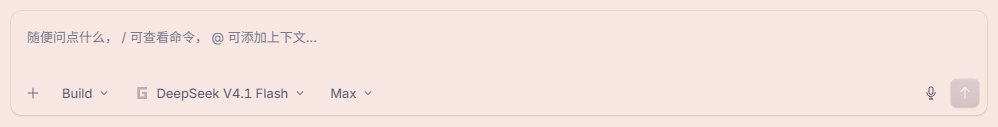

<h1 align="center">🎙 OpenCode Local Voice</h1>

<p align="center">
  <strong>Local voice input for OpenCode Desktop — just speak, don't type</strong>
</p>

<p align="center">
  Click the mic, talk, press Enter — your words land in the prompt box. Fully offline, zero API fees.
</p>

<p align="center">
  <a href="https://github.com/ForrestKang/opencode-local-voice/blob/main/LICENSE"></a>
  <a href="#quick-start"></a>
  <a href="https://github.com/ForrestKang/opencode-local-voice/releases/latest"></a>
  <a href="https://github.com/ForrestKang/opencode-local-voice/actions/workflows/ci.yml"></a>
</p>

<p align="center">
  <a href="#quick-start">Quick Start</a> · <a href="#features">Features</a> · <a href="#how-it-works">How it works</a> · <a href="#faq">FAQ</a> · <a href="../README.md">中文</a>
</p>

---

## Why OpenCode Local Voice?

Describing what you want is the most common thing you do in OpenCode — yet you have to type every prompt word by word:

- ⌨️ Long prompts are painful to type — you'd much rather just talk
- 🚫 **OpenCode Desktop has no built-in voice input** (office feature requests were closed as not planned)
- ☁️ Cloud voice plugins need API keys, network access, and money — and they upload your audio
- 🧩 The desktop app **doesn't load opencode plugins at all** (its server runs on Node, not Bun), so existing plugins simply won't work
- 🔌 Rolling your own means recording, encoding, CORS, permissions, process management… all a pile of chores

**OpenCode Local Voice turns it into one sentence:**

```
Install OpenCode Local Voice for me: https://raw.githubusercontent.com/ForrestKang/opencode-local-voice/main/docs/install.md
```

Send this to the AI agent on your machine (Claude Code, Cursor, Windsurf — anything that can run shell commands): it reads the install doc and handles dependencies, model download, patching and restart by itself.

> ⭐ **Star this project**: OpenCode updates overwrite the patch; I keep tracking new versions so a single re-apply always works.

### ✅ What you probably want to know first

| | |
|---|---|
| 💰 **Completely free** | Recognition runs on a local Whisper model — zero API cost. One-time model download ≈1.6GB (medium/small available for weaker machines) |
| 🔒 **Private by design** | Audio never leaves your computer: microphone → local service. **No uploads, no network calls** |
| 🎯 **Zero friction** | The mic button lives right next to the send button; nothing else about OpenCode changes |
| 🔄 **Update-proof** | When an OpenCode update overwrites the patch, re-run the one-click apply script — no reinstall |
| 🩺 **Self-diagnosing** | Renderer debug log + recognition service log make issues easy to pinpoint |
| 🧯 **Always reversible** | The original `app.asar` (and macOS `Info.plist`) are backed up; one script restores the stock app |

---

## Screenshots

<p align="center">
  
  <br>
  
</p>

> Real screenshots (light theme): top — idle state, the mic button sits just left of send; bottom — recording state (waveform + timer + stop).

---

## Features

- 🎤 **Mic button on the prompt toolbar** — same row and size as the send button, blends right in
- 🗣️ **Local recognition** — faster-whisper large-v3-turbo, GPU (CUDA) first, CPU fallback
- ⚡ **On-demand service** — nothing runs in the background; the local service auto-exits after 30 min idle to free VRAM/RAM
- ⌨️ **Press Enter to finish** — stop recording with Enter (or the stop button, or the 60s cap); Esc cancels
- 🧠 **Automatic language detection** — Chinese / English / mixed, no switching needed
- 🧩 **Independent of the plugin system** — desktop won't load plugins? Fine, we inject via asar
- 🧯 **Fully reversible** — backups, full-hash validation, one-command restore

---

## How it works

**This is a "local patch + local service" combo, not a regular plugin.**

OpenCode Desktop does not load opencode's plugin system (its server runs on Node instead of Bun — npm plugin cache is never created and local plugins never load), so we take a three-layer approach:

| Layer | File | Responsibility |
|---|---|---|
| ① Injected UI | `oc-mic.js` | Injected into the renderer: mic button, recording, local 16kHz WAV encoding, text insertion |
| ② Patcher | `patch-oc-mic.js` | Modifies `app.asar`: grants mic permission in the main process + adds the transcription IPC bridge + injects the script |
| ③ Recognition service | `stt_server.py` | Local HTTP service (127.0.0.1:47832) running faster-whisper |

```
┌──────────┐  MediaRecorder → WAV  ┌─────────────┐   IPC    ┌──────────────────┐
│ 🎤 button │ ────────────────────► │ preload     │ ───────► │ main-process     │
│ (injected)│                       │ bridge      │          │ patch (spawns    │
└──────────┘                       └─────────────┘          │ service on demand)│
                                                            └────────┬─────────┘
                                                                     │ HTTP
                                                            ┌────────▼─────────┐
                                                            │ stt_server.py     │
                                                            │ faster-whisper    │
                                                            │ 127.0.0.1:47832   │
                                                            └───────────────────┘
```

### Design principles

- **Local first** — model, service and recordings form a closed loop on your machine; no cloud dependency
- **Minimal footprint** — only three injection points inside `app.asar` (main / preload / entry HTML) plus one local Python service
- **Fail-safe** — the patcher runs a **full hash validation over 6900+ files** of the produced archive; any mismatch aborts before anything is written
- **Always reversible** — the stock `app.asar` is backed up on first apply; the restore script brings the official app back

---

## Supported platforms

| Capability | Windows | macOS |
|---|---|---|
| Mic button (toolbar injection) | ✅ | ✅ |
| Local recognition | ✅ CUDA first / CPU fallback | ✅ CPU (fast on Apple Silicon) |
| One-click install | `windows/install.ps1` | `macos/install.sh` |
| One-click restore | `restore-oc-mic.cmd` | `restore-oc-mic.sh` |
| Survives app updates | ✅ re-run apply | ✅ re-run apply (auto re-signs) |
| Platform extras | mic permission built into the patch | Info.plist permission entry + ad-hoc re-sign + asar integrity fuse check |

---

## Quick start

### 🪟 Windows

Requirements: Python 3.10+, Node.js LTS

```powershell
cd windows
powershell -ExecutionPolicy Bypass -File .\install.ps1
```

<details>
<summary>Optional flags &amp; what the installer does (click to expand)</summary>

Optional flags:

```powershell
-Model medium|small      # smaller model for weak machines (default auto: NVIDIA→turbo, else by core count)
-Cpu                     # force CPU, skip CUDA libraries
-SkipDeps / -SkipModel   # skip already-installed parts
-NoApply                 # set up the service only, don't patch the app
```

What it does:

1. Checks Python / Node
2. Creates a virtualenv and installs faster-whisper (plus CUDA libraries only when an NVIDIA GPU is detected — saves ~1.3GB otherwise)
3. Downloads the Whisper model from hf-mirror (resumable)
4. Deploys the recognition service to `~/.config/opencode/whisper/`
5. Generates and applies the `app.asar` patch (closes → replaces → restarts OpenCode)

</details>

### 🍎 macOS

Requirements: `python3`, `node` (`brew install node`)

```bash
cd macos
chmod +x *.sh
./install.sh
```

<details>
<summary>Optional flags (click to expand)</summary>

```bash
./install.sh --model medium      # Intel Macs default to medium; small is also available
./install.sh --pypi <index-url>  # defaults to the Tsinghua mirror
./install.sh --no-apply          # set up the service only, don't patch
```

The macOS flow additionally: adds the mic permission entry to `Info.plist` → disables the asar integrity fuse if enabled → ad-hoc re-signs the app (without this macOS reports the app as "damaged") → restarts.

</details>

On first use, allow the microphone when the system asks (macOS: System Settings → Privacy & Security → Microphone).

---

## Daily usage

| Scenario | Windows | macOS |
|---|---|---|
| Applied a change to `oc-mic.js` | run `apply-oc-mic.cmd` | `./apply-oc-mic.sh` |
| Restore the stock app | run `restore-oc-mic.cmd` | `./restore-oc-mic.sh` |
| **After an OpenCode update** | re-run `apply-oc-mic.cmd` | re-run `./apply-oc-mic.sh` |

> OpenCode updates overwrite `app.asar` (the patch is lost) — just re-apply, no reinstall needed.
> If a major update changes the injection anchors, the patcher **fails validation and aborts** instead of corrupting your install.

---

## Configuration (all optional)

| Variable | Default | Description |
|---|---|---|
| `OPENCODE_STT_LOCAL_PORT` | 47832 | Local recognition service port |
| `OPENCODE_STT_DEVICE` | auto | `auto` / `cuda` / `cpu` |
| `OPENCODE_STT_BEAM` | 5 | Decoding beam width (1 is slightly faster but hurts Chinese punctuation quality) |
| `OPENCODE_STT_THREADS` | 16 (Win) / 8 (mac) | CPU threads |
| `OPENCODE_WHISPER_MODEL_DIR` | `~/.config/opencode/whisper-models/large-v3-turbo` | Model directory |
| `OPENCODE_WHISPER_IDLE_SEC` | 1800 | Idle seconds before the service exits |
| `OPENCODE_APP_PATH` (macOS) | `/Applications/OpenCode.app` | App location |

---

## Security

| Measure | Description |
|---|---|
| 🔒 **Audio never leaves the machine** | Recordings only travel between local memory and the local service; there is no network upload path |
| 📦 **Controlled footprint** | Only three injection points in `app.asar` plus one local Python service; nothing system-wide |
| ✅ **Full validation** | The patcher hashes 6900+ files of its output; any anomaly aborts without writing |
| 💾 **Backups by default** | The stock `app.asar` (and `Info.plist` on macOS) is saved on first apply |
| 🧯 **One-command rollback** | The restore script brings back the official app |
| 👀 **Fully open source** | Every line is auditable; models come from public repositories |

> ⚠️ **Unofficial patch notice**: this project works by modifying OpenCode Desktop's installation files (`app.asar`). It is unofficial and intended for personal, educational use. Evaluate the risks yourself; major OpenCode upgrades may require waiting for adaptation.

---

## Uninstall

1. Restore the stock app: Windows `restore-oc-mic.cmd` / macOS `./restore-oc-mic.sh`
2. Optionally delete the local data:
   ```
   ~/.config/opencode/whisper-venv      # Python environment
   ~/.config/opencode/whisper-models    # models (≈1.6GB)
   ~/.config/opencode/whisper           # service + logs
   ```

---

## FAQ

- **No mic button?** → check the debug log: Windows `%TEMP%\oc-mic-debug.log`, macOS `$TMPDIR/oc-mic-debug.log` (attach it when filing an issue)
- **Recognition feels slow** → check `~/.config/opencode/whisper/stt_server.log`: `device=cuda` is the fast path; `cpu` means the GPU libraries are missing (works, just slower); CPU is normal on macOS. On weak machines, switch to `medium`/`small`
- **Chinese punctuation missing?** → v0.1.1+ normalizes half-width punctuation to full-width and retries with a punctuation prompt when a Chinese result has none
- **macOS says the app is "damaged"** → the script handles this automatically; if it persists, run `sudo xattr -dr com.apple.quarantine /Applications/OpenCode.app` and reopen
- **Model size** → large-v3-turbo ≈ 1.54GB (≈2GB VRAM/RAM). On an RTX 4060, 10s of speech transcribes in ~0.5–2s
- **A wall of `ResizeObserver` warnings in logs** → OpenCode's own noise, safe to ignore
- **TUI / CLI support?** → desktop-only for now (the TUI ecosystem already has mature voice plugins). `extras/voice-input.ts` keeps a plugin-style implementation for reference

---

## ⭐ Why this is worth a star

I use this project every day, so I keep maintaining it.

- Every OpenCode release that overwrites the patch → I verify the apply scripts still work
- New platforms (Linux desktop) and better engines → on the roadmap
- Found a problem? Open an [issue](https://github.com/ForrestKang/opencode-local-voice/issues) with the debug log attached

---

## Credits

[OpenCode](https://opencode.ai) · [faster-whisper](https://github.com/SYSTRAN/faster-whisper) · [CTranslate2](https://github.com/OpenNMT/CTranslate2) · [whisper.cpp model ecosystem](https://github.com/ggml-org/whisper.cpp) · [hf-mirror](https://hf-mirror.com)

## License

[MIT](../LICENSE)
